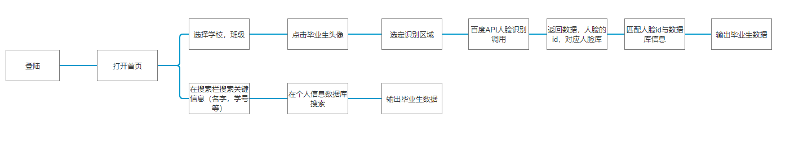
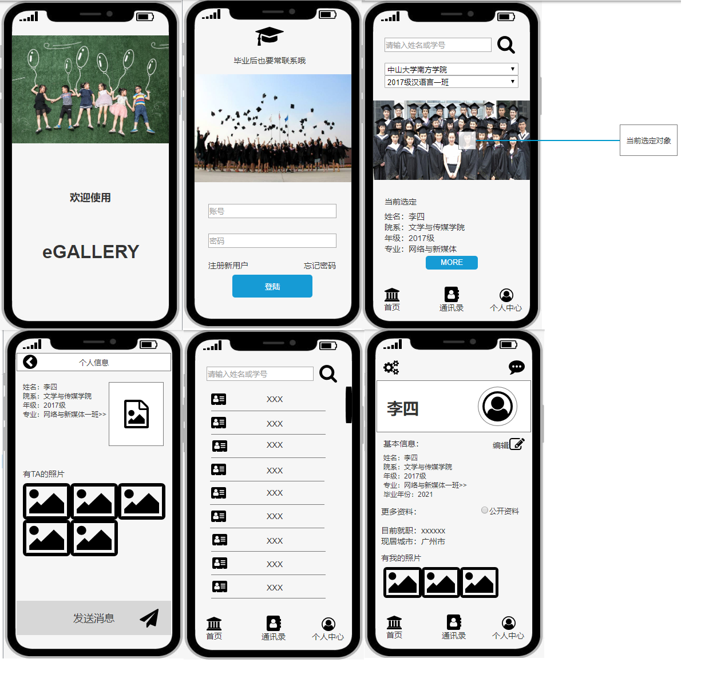
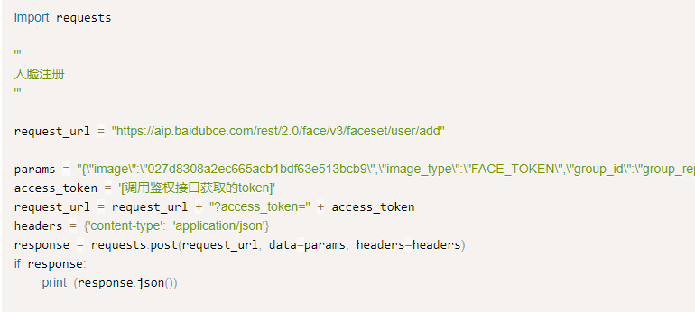

# API_F_PRD
## 项目：毕业相册通讯录APP
## 价值主张设计 
### 一、背景
目前，相册类应用的功能多以存储、分类、加密、分享为主。而针对毕业生这一群体，毕业相册常用于回忆过往的点滴，只能图个念想，并不能立马联系上老同学，即使是目前的相册类APP也无法实现联系对方的功能。那么，如果有一个智能的毕业相册，毕业生们在浏览毕业照的同时，也能够快速联系上对方，或与其相聚，毕业生们的念想便有机会化为现实。
### 二、加值宣言
目前，市面上的“相册APP”的功能主要以存储、加密、分享为主，例如“时光相册”、“相册管家”、“动感相册”等等。基于现状，针对用户联系的需求，将采用“百度人脸识别API”、对现有相册产品进行加值、优化。

用户输入一张图片（含被识别的主体），输出被识别主体的个人信息（如：微信账号）

### 三、核心价值（最小可行性产品）

基于大合照来管理照片上每个人的具体信息，通过调取百度的人脸识别api 实现对合照的人脸进行面部识别、统计总人数和男女人数、分析生物属性。通过用户提供的数据标记，来标识和存储每个人的具体信息，用户可拉大合照，点击脸部即可查询详细个人信息，轻松而全面地管理通讯录。

### 四、目标
即将毕业且仍希望与同学、朋友在以后保持联系的毕业生

### 五、核心价值与用户痛点

我们通常都是通过手机通讯录、各种社交软件来保存同学、好友的联系方式，虽然仍然可以联系，但是难以保存每个人具体的属性特征乃至长相的信息，无法在需要的时候准确的联系到同学。使用大合照作为储存联系方式的主体可以帮助我们轻松而全面地管理通讯录。

### 六、需求列表与人工智能API加值

基于百度深度学习能力的人脸识别技术，提供人脸检测与属性分析、人脸1：1对比、人脸搜索、活体检测等能力。灵活应用于金融、泛安防、零售等行业场景，满足身份核验、人脸考勤、闸机通行等业务需求。

### 七、人工智能概率性与用户痛点

检测图片中的人脸并标记出位置信息; 人脸关键点：展示人脸的核心关键点信息，及150个关键点信息。 人脸属性值：展示人脸属性信息，如年龄、性别等。 人脸质量信息：返回人脸各部分的遮挡、光照、模糊、完整度、置信度等信息。

## 原型

（图片显示不出来可能要刷新几次或等一会，感谢您的耐心等待）

### 产品流程图

### [产品原型预览](http://nfunm078.gitee.io/yuanxingyulan)

### [原型文档](final.rp)

### 原型图片预览

### 口头操作说明

欢迎大家使用毕业相册通讯录app，打开app首先看到登陆界面，输入账号密码登录后进入首页选择学校，班级，首页将会显示该班级的大合照。然后点击毕业生头像，下方会显示你当前选定人的简单信息，如果想查看更多请点击MORE按钮。点击之后可以看到更详细的信息和所有包含此人的相片，并且可以临时会话。在个人中心页面可以编辑自己的个人信息，还可以选择是否公开更详细的信息，查看有自己的照片。

## API 产品使用关键AI或机器学习之API的输出入展示
#### 人脸库导入

#### 人脸搜索

#### 人脸搜索输出结果

### API使用水平
输入：点击/触摸毕业生头像
输出：毕业生信息（姓名，性别，院系、班级）

### 使用比较分析
对比项:face++,百度API
Face++目前只有文字自定义训练库,有提供免费试用、WebAPI接入0.0005-0.01元/次等
百度api比较好，有自定义图像训练库，还有训练报告，有提供免费试用、开通续费0.0007元/次

### 使用后风险报告
1.单人特征识别中的性别识别。人脸识别仅能识别到人脸外貌更偏向女性还是男性，很难对女生男相、男生女相进行正确的判断。
2.人工智能概率性：由于照片人脸的角度、光线、发型问题，识别人脸会有出错几率。
